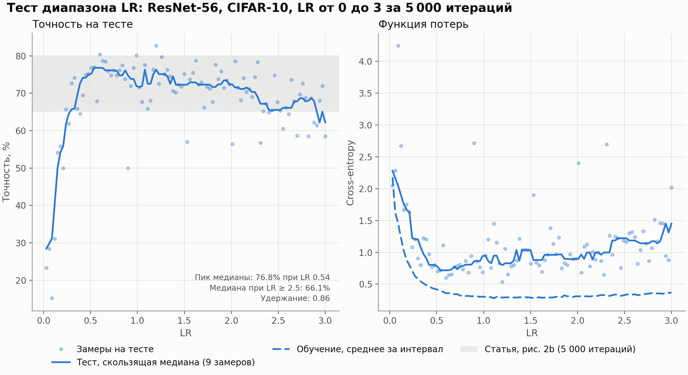
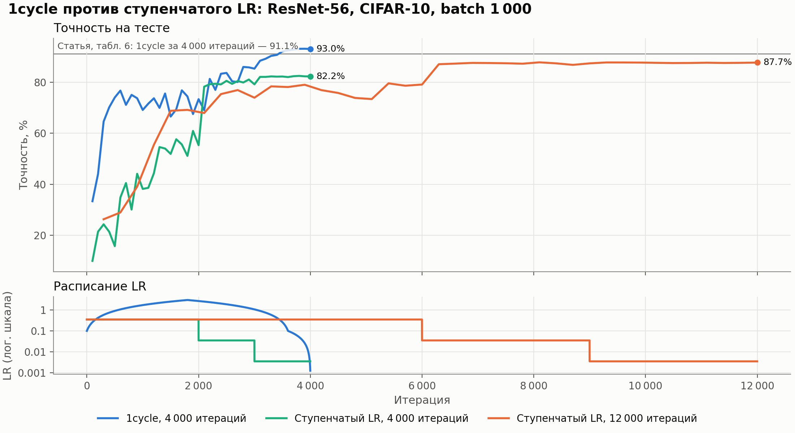
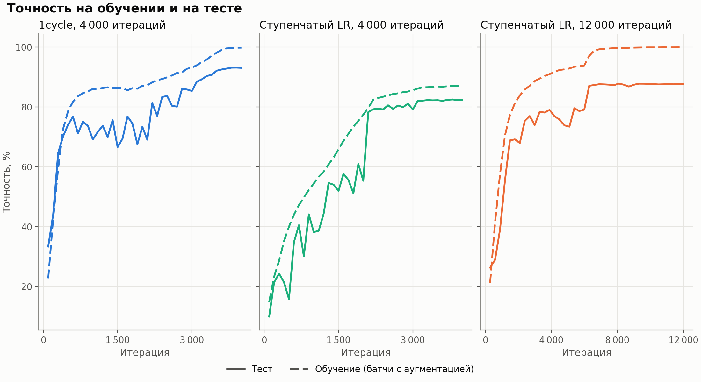
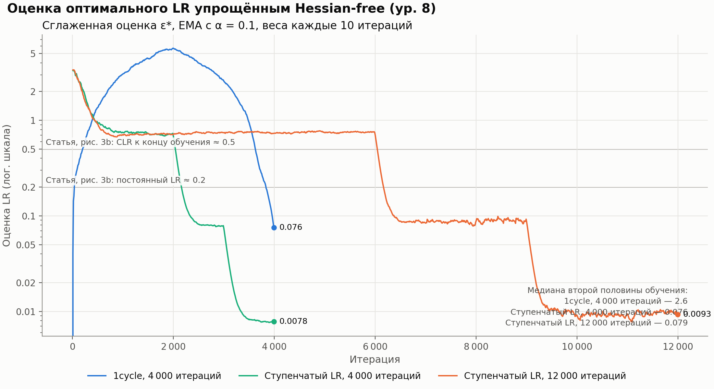

# Отчёт: воспроизведение «Super-Convergence»

> L. N. Smith, N. Topin. *Super-Convergence: Very Fast Training of Neural Networks Using Large Learning Rates*. arXiv:1708.07120v3, 2018.
> Воспроизведение: CIFAR-10, ResNet-56, Tesla T4, 2026-10-10 15:09 UTC.

## Коротко

Из 3 проверенных утверждений статьи подтвердились 2.

| Утверждение статьи | Статья | Наш результат | Вердикт |
|---|---|---|---|
| C1. Тест диапазона LR: точность ResNet-56 не падает при росте LR до 3 (нет «пика и спада») | после LR ≈ 0.5 плато ≈ 65–80% до LR = 3 (рис. 2b, 5k итераций) | плато 71.95%; пик медианы 76.79% при LR ≈ 0.54, при LR ≥ 2.5 — 66.11% (удержание 0.86) | 🟡 частично |
| C2. 1cycle с большим LR достигает той же или лучшей точности за кратно меньшее число итераций | 1cycle 4 000 it: 91.1%; ступенчатый 80 000 it: 91.2% | 1cycle 4 000 it: 93.03%; ступенчатый 4 000 it: 82.25%; ступенчатый 12 000 it: 87.68% | ✅ подтверждается |
| C3. Оценка оптимального LR (ур. 8) при 1cycle остаётся высокой, при стандартном режиме падает | к концу ≈ 0.5 при CLR против ≈ 0.2 при постоянном LR | медиана 2-й половины: 1cycle 2.61, ступенчатый 0.0792 (×32.92) | ✅ подтверждается |
| C4. Выигрыш super-convergence растёт при уменьшении объёма обучающих данных | 10k: 80.6% против 71.4% (+9.2 п.п.); 50k: +1.2 п.п. | — | ⏸ не запускалось |

## 1. Что утверждает статья

Авторы описывают явление **super-convergence**: при обучении с одним циклом скорости обучения (learning rate, LR; политика **1cycle**) и очень большим максимальным LR сеть сходится на порядок быстрее, чем при стандартном ступенчатом расписании, и к более высокой точности. Объяснение авторов — большой LR сам по себе регуляризует обучение, поэтому остальные регуляризаторы (weight decay и т.п.) нужно ослабить, чтобы сохранить баланс. Для проверки мы выбрали четыре утверждения, которые можно измерить напрямую (C1–C4 в таблице выше).

## 2. Метод

**Тест диапазона LR (LR range test).** Короткое обучение, во время которого LR линейно растёт от 0 до 3. Если точность на тесте остаётся высокой при LR, на порядок превышающих обычные (~0.1), для архитектуры возможна super-convergence.

**1cycle.** LR линейно растёт от `min_lr = 0.1` до `max_lr = 3.0` за первую половину цикла и так же линейно возвращается; цикл занимает 90% бюджета, на оставшихся итерациях LR опускается до `min_lr / 100`.

**Базовая линия: ступенчатый LR (piecewise-constant).** LR = 0.35, делится на 10 на 50% и 75% бюджета (значение LR — из статьи, моменты снижения статья не указывает).

**Оценка оптимального LR (ур. 8).** По трём последовательным векторам весов: ε* = ε · Σ|θᵢ₊₁ − θᵢ| / Σ|2θᵢ₊₁ − θᵢ − θᵢ₊₂|, сглаживание EMA с α = 0.1. Малая кривизна вдоль направления спуска (плоский минимум) даёт большую оценку.

## 3. Экспериментальная установка

| Параметр | Статья | Наше воспроизведение |
|---|---|---|
| Данные | CIFAR-10, 50 000 / 10 000 | то же, аугментация crop 32 из 40 + flip |
| Архитектура | ResNet-56 (табл. 3–5) | то же; shortcut — AvgPool 3×3, stride 2, без паддинга, как в табл. 4; stem со stride 1 (см. отклонения) |
| Batch | 1 000 (8 GPU) | 1 000 (1 GPU) |
| 1cycle | 0.1–3, 4 000 it, BN MAF 0.85 → 91.1% (табл. 6) | 0.1–3, 4 000 it, BN MAF 0.85 |
| Ступенчатый LR | LR 0.35, ~80 000 it, BN MAF 0.999 | LR 0.35, 4 000 и 12 000 it, BN MAF 0.99 |
| Тест диапазона LR | 0–3, 5k / 20k / 100k it, BN MAF 0.95 | 0–3, 5 000 it, BN MAF 0.95, весь тест каждые 50 it |
| SGD | Caffe, momentum 0.9, WD 1e-4 | momentum в форме Caffe (`v ← μv + lr·g`), 0.9, WD 1e-4 |
| Точность вычислений | fp32 | fp16 autocast + GradScaler |
| Фреймворк / железо | Caffe, Titan Black ×8 | PyTorch 2.11.0+cu130, Tesla T4 |
| Seed | — | 0, один прогон на конфигурацию |

### Все прогоны

| Прогон | Расписание | Эпох | Final test acc | Best test acc | Время, мин | Картинок/с | Расходимость | Пропущено шагов fp16 |
|---|---|---|---|---|---|---|---|---|
| lr_range_test | Тест диапазона LR, 5 000 итераций | 100 | 58.47% | 82.73% | 16 | 5 388 | нет | 0 |
| one_cycle | 1cycle, 4 000 итераций | 80 | 93.03% | 93.11% | 13 | 5 324 | нет | 0 |
| piecewise_equal_budget | Ступенчатый LR, 4 000 итераций | 80 | 82.25% | 82.47% | 13 | 5 416 | нет | 0 |
| piecewise_long_budget | Ступенчатый LR, 12 000 итераций | 240 | 87.68% | 87.78% | 38 | 5 313 | нет | 0 |

## 4. Результаты

### 4.1. Тест диапазона LR — 🟡 частично

*Рис. 1. Тест диапазона LR: точность (слева) и функция потерь (справа) в зависимости от LR; серая полоса — уровень кривой 5k с рис. 2b статьи.*

**Критерий.** Утверждение статьи качественное: в типичном range test (рис. 2a) точность достигает пика и затем падает, а у ResNet-56 (рис. 2b) остаётся высокой вплоть до LR = 3. Поэтому меряем **удержание** — медиану точности в конце диапазона (LR ≥ 2.5), делённую на пик сглаженной кривой. «Подтверждается» при удержании ≥ 0.9, «частично» — ≥ 0.75. Для контраста: у кривой AlexNet на рис. 2a удержание ≈ 0.45.

**Почему пик ищется по сглаженной кривой.** Каждая точка — точность одного снимка весов. При LR порядка единиц соседние снимки сильно различаются, и точность скачет на ±5–10 п.п. (на рис. 2b тоже). Максимум сырых замеров — случайный выброс, поэтому берётся скользящая медиана по 9 замерам.

**Результат.** Сглаженная точность достигает 76.79% при LR ≈ 0.54, при LR ≥ 2.5 медиана 66.11% — удержание **0.86**. Медиана точности на плато (LR ≥ 0.5) — 71.95%, в пределах уровня кривой 5k на рис. 2b (65–80%, оценка по графику). Сеть не расходится: точность на обучении при LR = 3 — 87.40%.

**Функция потерь (правая панель рис. 1, сравнение с рис. 8a).** Медианы train / test loss при LR 0.2–0.5: 0.53 / 1.03; при LR 1.5–2: 0.30 / 0.90. Train loss падает — за 5 000 итераций сеть ещё дообучается; разрыв test − train растёт (0.50 → 0.60). На рис. 8a статьи train loss ≈ 0.05–0.15, то есть тест там заметно длиннее нашего, поэтому этот эффект показан для справки и в вердикт C1 не входит.

### 4.2. 1cycle против ступенчатого LR — ✅ подтверждается

*Рис. 2. Точность на тесте по итерациям (сверху) и расписания LR (снизу); серая линия — результат 1cycle из табл. 6 статьи.*

При одинаковом бюджете 4 000 итераций 1cycle даёт 93.03% против 82.25% у ступенчатого режима (разница +10.78 п.п.). Против ступенчатого LR с бюджетом в 3 раза больше разница +5.35 п.п.; длинный ступенчатый режим за все 12 000 итераций так и не достиг итоговой точности 1cycle (93.03%). Наш результат 1cycle отличается от табл. 6 на +1.93 п.п. (91.1% в статье). Время обучения: 1cycle 13 мин против 38 мин у длинного ступенчатого режима.

Форма кривой 1cycle: на пике LR (итерация ≈ 1 800, LR ≈ 3.00) точность на тесте была 74.44%, к концу обучения — 93.03% (+18.6 п.п.). Основной прирост приходится на фазу спада LR, как на рис. 1a статьи: при большом LR сеть держится в «широкой» области, а финальное снижение LR позволяет ей опуститься в минимум.

*Рис. 3. Точность на обучении (штрих) и на тесте (сплошная) для каждого прогона.*

### 4.3. Оценка оптимального LR — ✅ подтверждается

*Рис. 4. Сглаженная оценка оптимального LR по ур. 8 (аналог рис. 3b статьи); серые линии — уровни из статьи.*

Медиана сглаженной оценки на второй половине обучения: **2.61** у 1cycle и **0.0792** у длинного ступенчатого режима (отношение 32.92). Сравнение качественное, как и в статье: вывод ур. 8 предполагает чистый градиентный спуск, а обучение идёт с momentum и weight decay; к тому же на рис. 3b статьи сравнение идёт с постоянным LR 0.1, а у нас LR снижается ступенями.

### 4.4. Ограниченный объём данных — ⏸ не запускалось

Эксперимент не запускался (RUN_LIMITED_DATA = False): он добавляет два долгих прогона на каждый размер выборки и не уложился в бюджет бесплатного Colab.

## 5. Отклонения от статьи и их возможное влияние

1. **Бюджет длинного ступенчатого режима:** 12 000 итераций вместо ~80 000 (1 600 эпох при batch 1 000 заняли бы на T4 больше суток). Поэтому мы проверяем более слабую форму утверждения C2: «1cycle не хуже стандартного режима, которому дали в 3 раза больше итераций».
2. **Тест диапазона LR** повторён для самой короткой из трёх кривых рис. 2b (5 000 итераций). Кривые на 20 000 и 100 000 итераций на рис. 2b той же формы, но примерно на 5 п.п. выше.
3. **BN MAF длинного ступенчатого режима:** 0.99 вместо 0.999 — пропорционально более короткому прогону (по логике приложения A.5 статьи).
4. **Stem со stride 1** вместо stride 2 из табл. 5: со stride 2 финальная карта 4×4 не согласуется с avg-pool 8×8 из той же таблицы.
5. **Смешанная точность fp16** вместо fp32 — ради скорости на T4; GradScaler пропускает шаги с переполнением.
6. **Моменты снижения LR** в ступенчатом режиме (50% и 75% бюджета) и **хвост 1cycle** (10% бюджета, спад до `min_lr / 100`) в статье не заданы — это наши допущения.
7. **Один seed на конфигурацию** — разброс между запусками (в статье ±0.1–1.0 п.п., табл. 2) не оценивался, поэтому разницы меньше ~0.5 п.п. стоит считать незначимыми.

## 6. Выводы

- **C1** (🟡 частично): плато 71.95%; пик медианы 76.79% при LR ≈ 0.54, при LR ≥ 2.5 — 66.11% (удержание 0.86).
- **C2** (✅ подтверждается): 1cycle 4 000 it: 93.03%; ступенчатый 4 000 it: 82.25%; ступенчатый 12 000 it: 87.68%.
- **C3** (✅ подтверждается): медиана 2-й половины: 1cycle 2.61, ступенчатый 0.0792 (×32.92).

Главное утверждение статьи воспроизводится: одного цикла с LR до 3 хватает, чтобы за 4 000 итераций получить точность не ниже, чем у стандартного режима за 12 000.

## 7. Как воспроизвести

Открыть [`super_convergence.ipynb`](super_convergence.ipynb) в Colab, выбрать T4 GPU, добавить секрет `GITHUB_TOKEN_EFFICIENT_NN` и выполнить `Run all`. Сырые кривые обучения — в `results/*.json`, сводка — в `results/summary.csv`, окружение — в `results/environment.json`.
